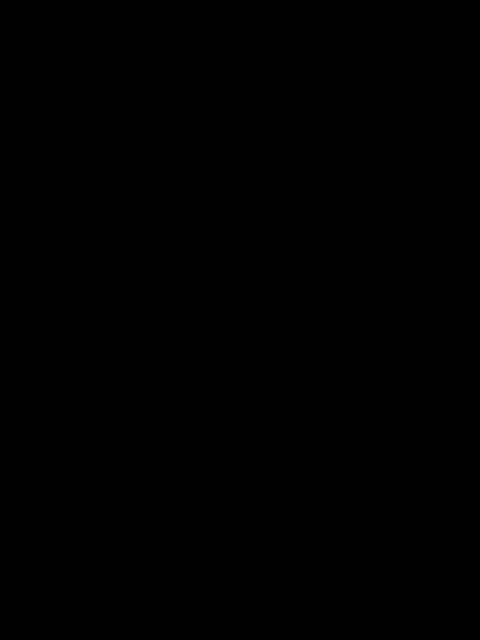
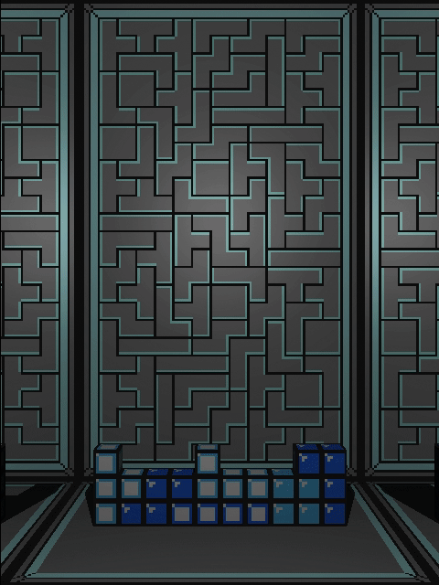

# Rendering Engine
A rendering engine capable of both rasterizing and raytracing 3D models through a fully transformable cartesian & spherical camera coordinate system. Utilizing an illumination system (phong), shading system (hard & soft), super-sampling anti-aliasing and interesting material properties such as mirrors, as shown in the animation below, for greater photorealism.

|Wireframe|Raster|Raytrace|
|---------|------|--------|
||||

|Translate|Rotate|Orbit|Extra|
|:-------:|:----:|:---:|:---:|
|<pre><b>   Horizontal - a/d   </b></pre>|<pre><b>   Yaw   - f/h   </b></pre>|<pre><b>   Azimuth - j/l   </b></pre>|<pre><b>  Mode - m/n  </b></pre>                  |
|<pre><b>   Vertical   - s/w   </b></pre>|<pre><b>   Pitch - g/t   </b></pre>|<pre><b>   Polar   - k/i   </b></pre>|<pre><b>  Look at origin - x  </b></pre>          |
|<pre><b>   Normal     - q/e   </b></pre>|<pre><b>   Roll  - r/y   </b></pre>|<pre><b>   Radius  - u/o   </b></pre>|<pre><b>  Undo all transformations - z  </b></pre>|